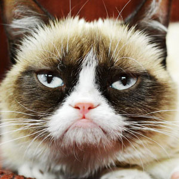

# Exercise 1
Create a Web page named `task1.html` as following:

[](https://postimg.cc/8JbfHLd3)

```html
<!DOCTYPE html>
<html lang="en">
<head>
	<meta charset="UTF-8">
	<meta name="viewport" content="width=device-width, initial-scale=1.0">
	<title>The Bachelor program is a important part of USTH</title>
</head>
<body>
	<h1>The Bachelor program is a important part of USTH</h1>
	<p>It is applying the European Credit Transfer and Accumulation Systems (ECTS) as in most of European countries, with the study program corresponds to 180 Credits in 3 years (60 credits/year).</p>
</body>
</html>
```
# Exercise 2
Create a web page named `task2.html` containing:
- A list of your most favorite movies.
  - Use ordered list.
- A list of subjects that you are studying in this semester.
  - Use unordered list.
```html
<h1>An ordered list about your most favorite movies</h1>
<ol>
	<li>Spider-man</li>
	<li>Fast and Furious</li>
	<li>The Super Mario Movies</li>
	<li>Indian Jones</li>
	<li>Frozen</li>
	<li>Stranger Things</li>
	<li>Avenger: Endgame</li>
	<li>oggy and the cockroaches</li>
</ol>
<hr>
<h1>An unordered list about your list of subjects that you are studying in this semester</h1>
<ul>
	<li>Machine Learning and Data Mining</li>
	<li>French 3.1</li>
	<li>French 3.2</li>
	<li>Web Application Development</li>
	<li>Mobile Application Development</li>
	<li>Object-oriented Systems Analysis and Design</li>
	<li>Graph Theory</li>
	<li>Advanced Databases</li>
	<li>Scientific Writing</li>
</ul>
```
# Exercise 3
Create a web page named task3.html, then do the following:
- Download about 3 images (size > 300x300 px). Save these images to a folder named `images` (a sub-folder of the folder containing `task3.html`).
- In the `task3.html`, write the code to show all downloaded images as thumbnails (i.e. images with size 50x50px).
```html
<!DOCTYPE html>
<html lang="en">
<head>
	<meta charset="UTF-8">
	<meta name="viewport" content="width=device-width, initial-scale=1.0">
	<title>Images page</title>
	<style>
		img {
			width: 50px;
			height: 50px;
		}
	</style>
</head>
<body>
	
	
	
</body>
</html>
```
# Exercise 4
Create a web page named `task4.html` so that each thumbnail in `task3.html` web page is a link to the corresponding full-size image.
```html
<!DOCTYPE html>
<html lang="en">
<head>
	<meta charset="UTF-8">
	<meta name="viewport" content="width=device-width, initial-scale=1.0">
	<title>Link images page</title>
	<style>
		img {
			width: 50px;
			height: 50px;
		}
	</style>
</head>
<body>
	<a href="./images/thumbs-up.png"></a>
	<a href="./images/pixelart.png"></a>
	<a href="./images/assignment.jpg"></a>
</body>
</html>
```
# Exercise 5
Create a web page named `task5.html` containing the following table:

[](https://postimg.cc/yWVLzPGD)

```html
<!DOCTYPE html>
<html lang="en">
<head>
	<meta charset="UTF-8">
	<meta name="viewport" content="width=device-width, initial-scale=1.0">
	<title>Timetable</title>
	<style>
		table, th, td {
			border: 1px solid black;
			border-collapse: collapse;
		}
		th, td {
			padding: 1em;
		}
		th {
			font-weight: bold;
		}
		td:first-child {
			font-weight: bold;
		}
	</style>
</head>
<body>
	<table>
		<thead>
			<tr>
				<th></th>
				<th>Monday</th>
				<th>Tuesday</th>
				<th>Wednesday</th>
				<th>Thursday</th>
				<th>Friday</th>
			</tr>
		</thead>
		<tbody>
			<tr>
				<td>Morning</td>
				<td>Math</td>
				<td rowspan="2">Chemistry</td>
				<td>Mobile</td>
				<td></td>
				<td>History</td>
			</tr>
			<tr>
				<td>Afternoon</td>
				<td>Physics</td>
				<td></td>
				<td></td>
				<td></td>
			</tr>
		</tbody>
	</table>
</body>
</html>
```
# Exercise 6
Write a web page named `task6.html`, having two paragraphs. Define CSS rules so that:
- Text size of the first paragraph is 0.5 of the normal font size (i.e. 1em).
- Text color of the second paragraph is red.
- Use id selector for the first paragraph, class selector for the second paragraph.
- Add another paragraph (called the third paragraph) also having the red text.
- Use inline style, embedded style, and external style for the created web page, having three paragraphs (first, second, third).
```html
<!DOCTYPE html>
<html lang="en">
<head>
	<meta charset="UTF-8">
	<meta name="viewport" content="width=device-width, initial-scale=1.0">
	<title>3 paragraphs</title>
	<style>
		/* second paragraph */
		.second {
			color: red;
		}
	</style>
</head>
<body>
	<p id="first">Lorem ipsum dolor sit amet consectetur, adipisicing elit. Nesciunt voluptatum distinctio cupiditate ab laudantium ipsam asperiores magnam architecto, molestiae assumenda quos quae nulla nemo, aspernatur, itaque ut qui tempora voluptate!</p>
	<p class="second">Lorem ipsum dolor sit amet consectetur adipisicing elit. Doloribus maxime, nulla aliquam voluptas reprehenderit labore eos autem optio necessitatibus neque molestiae debitis sed impedit facere perferendis voluptatum cupiditate consequuntur modi.</p>
	<!-- third paragraph red text -->
	<p id="third" style="color: red;">Lorem ipsum dolor sit amet consectetur adipisicing elit. Beatae deserunt explicabo, nostrum temporibus magni adipisci ipsum iure illo. Quas sit eligendi officiis facere omnis atque voluptatum cupiditate et veniam sapiente.</p>
</body>
</html>
```
```css
html {
	padding-bottom: 4em;
}

body {
	font-family: sans-serif;
	line-height: 1.5em;
	max-width: 40em;
	padding: 0 2%;
	margin: auto;
	background-color: #eeeeec;
	color: #2e3436;
}

/* first paragraph */
#first {
	font-size: 0.5em;
}
```
# Exercise 7
Create a web page named `task7.html`, containing an image:
- Decorate the image with a border
  - Color: red
  - Size: 5px
  - Solid
- Use `pseudo-class` hover to change the appearance of the image when the mouse is on the image
```html
<!DOCTYPE html>
<html lang="en">
<head>
	<meta charset="UTF-8">
	<meta name="viewport" content="width=device-width, initial-scale=1.0">
	<title>Border images</title>
	<style>
		img {
			border: 5px solid red;
		}
		img:hover {
			border-radius: 7%;
		}
	</style>
</head>
<body>
	
</body>
</html>
```
# Exercise 8
Create a web page named `task8.html`, containing three links to other pages:
- Use property `text-decoration` to remove the underlines
- If a link is visited, then its color becomes red.
- Change the color of the links to green when the mouse is over
```html
<!DOCTYPE html>
<html lang="en">
<head>
	<meta charset="UTF-8">
	<meta name="viewport" content="width=device-width, initial-scale=1.0">
	<title>Three links to other pages</title>
	<style>
		a {
			text-decoration: none;
		}
		a:visited {
			color: red;
		}
		a:hover {
			color: green;
		}
	</style>
</head>
<body>
	<a href="https://en.wikipedia.org/wiki/Machine_learning" target="_blank">Machine Learning</a><br>
	<a href="https://en.wikipedia.org/wiki/Supervised_learning" target="_blank">Supervised learning</a><br>
	<a href="https://en.wikipedia.org/wiki/Stochastic_gradient_descent" target="_blank">Stochastic gradient descent</a><br>
</body>
</html>
```

[](https://postimg.cc/vcmMD54B)

# Exercise 9
Create a web page named `task9.html`, containing a table as following:

[](https://postimg.cc/ftMpphXL)

Provide CSS so that the row pointed by the mouse is highlighted.
```html
<!DOCTYPE html>
<html lang="en">
<head>
	<meta charset="UTF-8">
	<meta name="viewport" content="width=device-width, initial-scale=1.0">
	<title>Subjects in USTH Hanoi</title>
	<style>
		table, th, td {
			border: 1px solid black;
			border-collapse: collapse;
			padding: 10px;
		}
		th {
			background-color: #1f497d;
		}
		
		td {
			text-align: center;
			vertical-align: middle;
			background-color: #e9edf4;
		}

		table tr td:first-child:hover ~ td,
		td:first-child:hover {
			background-color: #d0d8e8;
		}
	</style>
</head>
<body>
	<table style="width: 100%;">
		<thead>
			<tr>
				<th style="width: 21em;">Subject</th>
				<th style="width: 12em;">ECTS</th>
			</tr>
		</thead>
		<tbody>
			<tr>
				<td>Math</td>
				<td>3</td>
			</tr>
			<tr>
				<td>Physics</td>
				<td>5</td>
			</tr>
			<tr>
				<td>Chemistry</td>
				<td>4</td>
			</tr>
			<tr>
				<td>English</td>
				<td>3</td>
			</tr>
		</tbody>
	</table>
</body>
</html>
```
# Exercise 10
Create a web page named `task10.html`, having the layout as following (each part is a `<div>` element):

[](https://postimg.cc/yg6pny43)

```html
<!DOCTYPE html>
<html lang="en">
<head>
	<meta charset="UTF-8">
	<meta name="viewport" content="width=device-width, initial-scale=1.0">
	<title>Layout page</title>
</head>
<body>
	<header style="background-color: #4472c4; height: 100px;"></header>

	<main style="display: flex; flex-direction: row; height: calc(100vh - 150px);">
		<div class="left-part" style="background-color: #dbdbdb; width: 30%;"></div>

		<div class="right-part" style="background-color: #c5e0b4; width: 70%;"></div>
	</main>

	<footer style="background-color: #4472c4; height: 50px;"></footer>
</body>
</html>
```
# Exercise 11
Use HTML and CSS to create a website for viewing categorized photos as following:

[](https://postimg.cc/w1hWpG9s)

The functions of the website are:
- The web page has two panels. The left one contains links to eah category. When a link in the left panel is clicked, the right panel shows images in corresponding category.
- Photos are displayed in the right panel with thumbnail style and have thin borders.
- When a thumbnail image is clicked, the corresponding full-size photo will be displayed in a pop-up window.
- The web page should have an "About" link pointing to a page containing the name of the student who develops the website.
```html
<!DOCTYPE html>
<html lang="en">
<head>
	<meta charset="UTF-8">
	<meta name="viewport" content="width=device-width, initial-scale=1.0">
	<title>Landing Page</title>
	<link rel="stylesheet" href="task11.css">
</head>
<body>
	<header>
		<h1>Banner</h1>
	</header>

	<main>
		<div class="left-part">
			<div data-tab-target="#thumbnail1" class="categ active" id="category1">
				<h3>Category 1</h3>
			</div>
			<div data-tab-target="#thumbnail2" class="categ" id="category2">
				<h3>Category 2</h3>
			</div>
			<div data-tab-target="#thumbnail3" class="categ" id="category3">
				<h3>Category 3</h3>
			</div>
			<div data-tab-target="#about_student" class="categ" id="about">
				<h3>About</h3>
			</div>
		</div>

		<div class="right-part">
			<div data-tab-content class="thumbnail active" id="thumbnail1">
				<a target="popup" href="./images/thumbs-up.png">
					
				</a>
			</div>

			<div data-tab-content class="thumbnail" id="thumbnail2">
				<a target="popup" href="./images/pixelart.png">
					
				</a>
			</div>

			<div data-tab-content class="thumbnail" id="thumbnail3">
				<a target="popup" href="./images/assignment.jpg">
					
				</a>
			</div>

			<div data-tab-content class="thumbnail" id="about_student">
				<h2>Student's name: Nguyễn Quang Anh</h2>
			</div>
		</div>
	</main>

	<footer>
		<h2>Copyright</h2>
	</footer>
</body>

<script src="task11.js"></script>
</html>
```
```css
* {
	margin: 0;
}

[data-tab-content] {
	display: none;
}

.active[data-tab-content] {
	display: block;
}

body {
	display: flex;
	flex-direction: column;
	gap: 10px;
}

header {
	background-color: #5b9bd5;
	height: 100px;
	display: flex;
	justify-content: center;
	align-items: center;
}

h1 {
	color: white;
}

main {
	display: flex;
	flex-direction: row;
	height: calc(100vh - 170px);
	gap: 10px;
}

.left-part {
	background-color: #5b9bd5;
	width: 30%;
	padding: 40px 20px;
}

#category1 {
	display: flex;
	justify-content: center;
	align-items: center;
	background-color: #538135;
	padding: 10px;
	margin: 20px 0;
	cursor: pointer;
}

#category2 {
	display: flex;
	justify-content: center;
	align-items: center;
	background-color: #538135;
	padding: 10px;
	margin: 20px 0;
	cursor: pointer;
}

#category3 {
	display: flex;
	justify-content: center;
	align-items: center;
	background-color: #538135;
	padding: 10px;
	margin: 20px 0;
	cursor: pointer;
}

h3 {
	color: white;
}

#about {
	display: flex;
	justify-content: center;
	align-items: center;
	background-color: #538135;
	padding: 10px;
	margin: 20px 0;
	cursor: pointer;
}

.right-part {
	background-color: #5b9bd5;
	width: 70%;
	padding: 40px 20px;
	display: grid;
	grid-template-columns: repeat(4, 1fr);
	grid-template-rows: repeat(2, 1fr);
	gap: 20px;
}

#thumbnail1, #thumbnail2, #thumbnail3 {
	height: 300px;
	width: 300px;
	padding: 10px;
	margin: 20px 0;
	border: 1px solid;
}

img {
	height: 300px;
	width: 300px;
}

h2 {
	color: white;
}

footer {
	background-color: #5b9bd5;
	height: 50px;
	display: flex;
	justify-content: center;
	align-items: center;
}
```
```js
const cates = document.querySelectorAll("[data-tab-target]");
const thumbnails = document.querySelectorAll("[data-tab-content]");

cates.forEach((cate) => {
	cate.addEventListener("click", () => {
		const target = document.querySelector(cate.dataset.tabTarget);
		thumbnails.forEach((thumbs) => {
			thumbs.classList.remove("active");
		});
		cates.forEach((cate) => {
			cate.classList.remove("active");
		});
		cate.classList.add("active");
		target.classList.add("active");
	});
});
```